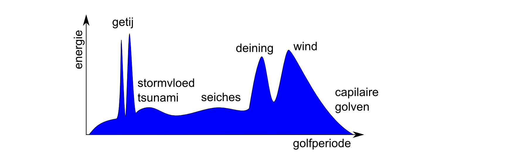

<!-- TO DO:
- Check of alles werkt.
- bijlage referentie

-->

```{r setupHydro, include=FALSE}
knitr::opts_chunk$set(
	echo = FALSE,
	message = FALSE,
	warning = FALSE,
	out.width = "85%",
	fig.align='center'
)
```

```{r}
# Load function to write Latex table structure to R 
source("Rscripts/tex2Rtable.R")

# Set year for use in the report
dataJaar <- 2019
```

# Hydrodynamiek {#hydro}

Dit hoofdstuk betreft metingen van de waterbeweging in de Westerschelde en de monding. De rapportage wordt hierbij beperkt tot waterstanden en golven. De waterstanden zijn opgenomen als jaargemiddelde hoog- en laagwaterstanden en de gemiddelde getijslag. Daarnaast zijn de belangrijkste componenten van het getij (M2, S2 en M4-component) weergegeven. Voor golven worden maandgemiddelden en -maxima van de golfhoogte en -periode gepresenteerd.

## Waterstanden {#waterstanden}

```{r getijgolf, fig.cap="Weergave van een getijgolf met aanduiding hoogwater, laagwater, getijslag en dagelijkse ongelijkheid op basis van @VanRijn1994a"}
knitr::include_graphics("Figuren/Inscape/getijgolf.png")
```

De waterstanden in de Westerschelde worden voor het grootste deel bepaald door het getij. Het getij ontstaat door de aantrekkende kracht van de maan en de zon op de aarde. De variaties in het getij ontstaan door de draaiing van de aarde en de positie van de aarde t.o.v. de maan en de zon en doordat de maan en de aarde zich in een baan rond de zon bewegen. Daarnaast wordt het getij vervormd door de bodemligging van zeeën en oceanen. Wiskundig gezien is het getij een combinatie van een groot aantal sinusvormige golven: de getijcomponenten. De M2-component ontstaat door de aantrekkingskracht van de maan en is een belangrijke getijcomponent in de Noordzee en de Westerschelde, zie verder Paragraaf \@ref(hydroGetijcomponenten). De belangrijkste periodieke variaties in het getij zorgen voor de zogeheten dagelijkse ongelijkheid (Figuur \@ref(fig:getijgolf)), de springtij-doodtij cyclus en de 18,6-jarige cyclus. 

<!-- % @: update this figure
\begin{figure}[h!] 
\centering
  \includegraphics[width=1\linewidth]{../Figuren/Inscape/getijgolf.png}
  \caption[Getijgolf met hoogwater en laagwater op basis van \cite{VanRijn1994a}]{Weergave van een getijgolf met aanduiding hoogwater, laagwater, getijslag en dagelijkse ongelijkheid op basis van \cite{VanRijn1994a}}
\label{fig:getijgolf}
\end{figure} -->


Het getij wordt verder vervormd in het estuarium. Vanaf de monding dringt het tij als een langgerekte golf het estuarium binnen. De geringer wordende diepte en vernauwing van de bedding vervormen het getij. Door die versmalling ondergaat het vloedwater een opstuwing; de hoogwaters worden hoger naarmate ze het estuarium dieper binnendringen. Energieverliezen ten gevolge van wrijving doen de verhoging door de opstuwing gedeeltelijk weer teniet. Tot slot zijn er nog de weersinvloeden zoals windopzet en luchtdruk. Al deze effecten zijn terug te zien in de gemeten waterstanden van de verschillende meetstations in de Westerschelde. 

### Informatie over de metingen {#hydroInfoMeting}

De waterstand in de Westerschelde wordt tegenwoordig continu gemeten op meerdere vaste stations in de Westerschelde. Van deze continue meting wordt een 10-minuten gemiddelde bepaald. Deze meetreeks wordt gebruikt om o.a. de getijcomponenten te bepalen. Daarnaast worden de maximale hoog- en laagwaterstanden geregistreerd, wat betekent dat ongeveer elke 6 uur een waarde wordt geregistreerd. 

De stations zijn zowel landelijke als regionale meetpunten (zie Figuur \@ref(fig:metingenWaterstanden) en Tabel \@ref(tab:metingenWaterstandenTab)), waarvan de meetdata beschikbaar zijn gesteld door het VLIZ (Vlaams Instituut voor de Zee). Alleen voor de landelijke meetpunten wordt een getijanalyse uitgevoerd en daarom worden voor deze stations de getijcomponenten M2, M4 en S2 gerapporteerd. 

In Paragraaf \@ref(hydroHWLW) zijn de jaargemiddelde hoog- en laagwaterstanden per station weergegeven. Het verschil tussen de hoog- en laagwaterstanden geeft de gemiddelde getijslag, zie Paragraaf \@ref(hydroGetijslag). De meetgegevens zijn *niet* gecorrigeerd voor de 18,6-jarige cyclus. Tot slot wordt voor de landelijke meetpunten de amplitude en fase van de M2, M4 en S2 getijcomponenten weergegeven in Paragraaf \@ref(hydroGetijcomponenten).

Om trends in de waterstanden te kunnen herkennen, wordt de data over een lange periode weergegeven: vanaf 1950 tot heden. Sommige stations zijn pas na 1950 in werking getreden. Vanzelfsprekend wordt voor deze stations de gehele beschikbare meetperiode weergegeven. Het waterstandsmeetpunt Schaar van de Noord is van 9 juli 2013 tot 25 juni 2015 niet in gebruik geweest. 

<!-- % Update this figure -->
<!-- \begin{figure}[h!]  -->
<!-- \centering -->
<!--   \includegraphics[width=1\linewidth]{../Figuren/Meetstations_waterstanden.png} -->
<!--   \caption{Ligging van de meetstations voor de waterstanden} -->
<!-- \label{fig:meetstations_waterstanden} -->
<!-- \end{figure}  -->

```{r metingenWaterstanden, fig.cap="Ligging van de meetstations voor de waterstanden"}
knitr::include_graphics("Figuren/Meetstations_waterstanden.png")
```

<!-- \begin{table}[h!] -->
<!-- \centering -->
<!-- \caption[Overzicht meetperiode van de waterstand per meetstation]{Overzicht meetperiode van de waterstand per meetstation. Een asterisk (*) betekent dat data vanaf 1950 is gebruikt.} -->
<!-- \label{table:meetstations_waterstanden} -->
<!-- \begin{tabular}{l|l|l|l} -->
<!-- %\hline -->
<!-- \rowcolor[HTML]{EFEFEF} -->
<!-- Landelijk meetstation & Meetperiode & Regionaal meetstation  & Meetperiode                 \\ \hline -->
<!-- Bath                  & 1957-heden  & Baalhoek               & 1996-heden                  \\% \hline -->
<!-- Hansweert             & 1880*-heden & Gat van Borssele       & 1996, 1998-heden            \\ %\hline -->
<!-- Terneuzen             & 1878*-heden & Breskens voorhaven     & 1996, 1998-2016            \\ %\hline -->
<!-- Vlissingen            & 1881*-heden & Overloop van Hansweert & 1996, 1998-2004, 2008-heden \\% \hline -->
<!-- Cadzand               & 1966-heden  & Vlakte van de Raan     & 1996, 1998-heden            \\% \hline -->
<!-- Westkapelle           & 1954-heden  & Schaar van de Noord    & 1996-2013, 2015-heden                  \\% \hline -->
<!-- Europlatform          & 1983-heden  & Walsoorden             & 1996, 1998-heden            \\ %\hline -->
<!-- \end{tabular} -->
<!-- \end{table} -->

```{r metingenWaterstandenTab}
dt <- data.frame(
  col1 = c("Bath","Hansweert","Terneuzen","Vlissingen","Cadzand","Westkapelle","Europlatform"),
  col2 = c("1957-heden","1880*-heden","1878*-heden","1881*-heden","1966-heden","1954-heden","1983-heden"),
  col3 = c("Baalhoek","Gat van Borssele","Breskens voorhaven","Overloop van Hansweert","Vlakte van de Raan","Schaar van de Noord","Walsoorden"),
  col4 = c("1996-heden","1996, 1998-heden","1996, 1998-2016","1996, 1998-2004, 2008-heden","1996, 1998-heden","1996-2013, 2015-heden","1996, 1998-heden")
)
knitr::kable(dt, col.names = c("Landelijk meetstation","Meetperiode","Regionaal meetstation","Meetperiode"), caption = "Overzicht meetperiode van de waterstand per meetstation. Een asterisk (*) betekent dat data vanaf 1950 is gebruikt.")
```

<!-- %CHECK: -->
<!-- %Het waterstandsmeetpunt Schaar van de Noord is sinds 2014 niet meer in gebruik en daarom is in deze Eerstelijnsrapportage dit meetpunt niet (meer) opgenomen. Voor metingen tot en met 2013 wordt er verwezen naar de Eerstelijnsrapportage 2013. -->

### Jaargemiddelde hoog- en laagwaterstanden {#hydroHWLW}

In de grafieken (Figuur \@ref(fig:hydroJaarEuro) tot en met Figuur \@ref(fig:hydroJaarBath)) onderstaand en op de volgende pagina's zijn de hoog- en laagwaterstanden ten opzichte van NAP per jaar gemiddeld en uitgezet in de tijd. Gemiddelde hoogwaterstanden in blauw corresponderen met de blauwe y-as (links) en gemiddelde laagwaterstanden zijn weergegeven in rood en corresponderen met de rode y-as (rechts). Voor jaren met missende data voor twee of meer maanden worden de gemiddeldes met dunnere en transparante kleuren weergegeven. Aan deze gemiddeldes kan minder waarde gehecht worden. De volgorde waarin de stations zijn weergegeven is stroomopwaarts: vanaf het Europlatform in de Noordzee tot de Belgische grens.

Het station Schaar van de Noord heeft voor 2014 geen data. In 2013 is alleen data beschikbaar voor tot juli 2013, dus slechts ongeveer een half jaar. Het jaar 2013 lijkt voor Schaar van de Noord een lagere waarde te geven (zie Figuur \@ref(fig:hydroJaarSvdn)), maar het kan zijn dat de lengte van de dataset van 2013 dit gemiddelde beïnvloedt. De laatste twee jaren geven waardes die in het verlengde liggen van de jaren voor 2013. 

*Let op: de y-assen van de figuur van het Europlatform verschillen van de y-assen van de andere stations.*

<!-- % 1. -->
<!-- \begin{figure}[h!]  -->
<!-- \centering -->
<!--   \includegraphics[width=0.95\linewidth]{../Figuren/Hydro/Waterstanden/HWLW/euro.png} -->
<!--   \caption{Jaargemiddelde hoog- en laagwaterstanden bij het Europlatform} -->
<!--   \label{fig:hydro_jaar_euro} -->
<!-- \end{figure}  -->

```{r hydroJaarEuro, fig.cap="Jaargemiddelde hoog- en laagwaterstanden bij het Europlatform"}
knitr::include_graphics("Figuren/Hydro/Waterstanden/HWLW/euro.png")
```

<!-- <!-- % 2.  -->
<!-- \begin{figure}[h!]  -->
<!-- \centering -->
<!--   \includegraphics[width=0.95\linewidth]{../Figuren/Hydro/Waterstanden/HWLW/raan.png} -->
<!--   \caption{Jaargemiddelde hoog- en laagwaterstanden bij de Vlakte van de Raan} -->
<!-- \end{figure}  -->

```{r hydroJaarRaan, fig.cap="Jaargemiddelde hoog- en laagwaterstanden bij de Vlakte van Raan"}
knitr::include_graphics("Figuren/Hydro/Waterstanden/HWLW/raan.png")
```

<!-- <!-- % 3. -->
<!-- \begin{figure}[h!]  -->
<!-- \centering -->
<!--   \includegraphics[width=0.95\linewidth]{../Figuren/Hydro/Waterstanden/HWLW/cadz.png} -->
<!--   \caption{Jaargemiddelde hoog- en laagwaterstanden bij Cadzand} -->
<!-- \end{figure}  -->

```{r hydroJaarCadz, fig.cap="Jaargemiddelde hoog- en laagwaterstanden bij Cadzand"}
knitr::include_graphics("Figuren/Hydro/Waterstanden/HWLW/cadz.png")
```

<!-- % 4.  -->
<!-- \begin{figure}[h!]  -->
<!-- \centering -->
<!--   \includegraphics[width=0.90\linewidth]{../Figuren/Hydro/Waterstanden/HWLW/wkap.png} -->
<!--   \caption{Jaargemiddelde hoog- en laagwaterstanden bij Westkapelle} -->
<!-- \end{figure}  -->

```{r hydroJaarWkap, fig.cap="Jaargemiddelde hoog- en laagwaterstanden bij Westkapelle"}
knitr::include_graphics("Figuren/Hydro/Waterstanden/HWLW/wkap.png")
```

<!-- % 5. -->
<!-- \begin{figure}[h!]  -->
<!-- \centering -->
<!--   \includegraphics[width=0.90\linewidth]{../Figuren/Hydro/Waterstanden/HWLW/bres.png} -->
<!--   \caption{Jaargemiddelde hoog- en laagwaterstanden bij Breskens voorhaven} -->
<!-- \end{figure}  -->

```{r hydroJaarBres, fig.cap="Jaargemiddelde hoog- en laagwaterstanden bij Breskens voorhaven"}
knitr::include_graphics("Figuren/Hydro/Waterstanden/HWLW/bres.png")
```

<!-- % 6. -->
<!-- \begin{figure}[h!]  -->
<!-- \centering -->
<!--   \includegraphics[width=0.90\linewidth]{../Figuren/Hydro/Waterstanden/HWLW/vlis.png} -->
<!--   \caption{Jaargemiddelde hoog- en laagwaterstanden bij Vlissingen} -->
<!-- \end{figure}  -->

```{r hydroJaarVlis, fig.cap="Jaargemiddelde hoog- en laagwaterstanden bij Vlissingen"}
knitr::include_graphics("Figuren/Hydro/Waterstanden/HWLW/vlis.png")
```

<!-- \clearpage -->
<!-- % 7. -->
<!-- \begin{figure}[h!]  -->
<!-- \centering -->
<!--   \includegraphics[width=0.90\linewidth]{../Figuren/Hydro/Waterstanden/HWLW/bors.png} -->
<!--   \caption{Jaargemiddelde hoog- en laagwaterstanden bij Gat van Borssele} -->
<!-- \end{figure}  -->

```{r hydroJaarBors, fig.cap="Jaargemiddelde hoog- en laagwaterstanden bij Gat van Borssele"}
knitr::include_graphics("Figuren/Hydro/Waterstanden/HWLW/bors.png")
```

<!-- % 8.  -->
<!-- \begin{figure}[h!]  -->
<!-- \centering -->
<!--   \includegraphics[width=0.90\linewidth]{../Figuren/Hydro/Waterstanden/HWLW/ovlh.png} -->
<!--   \caption{Jaargemiddelde hoog- en laagwaterstanden bij Overloop van Hansweert} -->
<!-- \end{figure}  -->

```{r hydroJaarOvlh, fig.cap="Jaargemiddelde hoog- en laagwaterstanden bij Overloop van Hansweert"}
knitr::include_graphics("Figuren/Hydro/Waterstanden/HWLW/ovlh.png")
```

<!-- % 9.  -->
<!-- \begin{figure}[h!]  -->
<!-- \centering -->
<!--   \includegraphics[width=0.90\linewidth]{../Figuren/Hydro/Waterstanden/HWLW/tern.png} -->
<!--   \caption{Jaargemiddelde hoog- en laagwaterstanden bij Terneuzen} -->
<!-- \end{figure}  -->

```{r hydroJaarTern, fig.cap="Jaargemiddelde hoog- en laagwaterstanden bij Terneuzen"}
knitr::include_graphics("Figuren/Hydro/Waterstanden/HWLW/tern.png")
```

<!-- % 10. -->
<!-- \begin{figure}[h!]  -->
<!-- \centering -->
<!--   \includegraphics[width=0.90\linewidth]{../Figuren/Hydro/Waterstanden/HWLW/hans.png} -->
<!--  \caption{Jaargemiddelde hoog- en laagwaterstanden bij Hansweert} -->
<!-- \end{figure}  -->

```{r hydroJaarHans, fig.cap="Jaargemiddelde hoog- en laagwaterstanden bij Hansweert"}
knitr::include_graphics("Figuren/Hydro/Waterstanden/HWLW/hans.png")
```

<!-- % 11. -->
<!-- \clearpage -->
<!-- \begin{figure}[h!]  -->
<!-- \centering -->
<!--   \includegraphics[width=0.90\linewidth]{../Figuren/Hydro/Waterstanden/HWLW/wals.png} -->
<!--  \caption{Jaargemiddelde hoog- en laagwaterstanden bij Walsoorden} -->
<!-- \end{figure}  -->

```{r hydroJaarWals, fig.cap="Jaargemiddelde hoog- en laagwaterstanden bij Walsoorden"}
knitr::include_graphics("Figuren/Hydro/Waterstanden/HWLW/wals.png")
```

<!-- % 12. -->
<!-- \begin{figure}[h!]  -->
<!-- \centering -->
<!--   \includegraphics[width=0.90\linewidth]{../Figuren/Hydro/Waterstanden/HWLW/baal.png} -->
<!--  \caption{Jaargemiddelde hoog- en laagwaterstanden bij Baalhoek} -->
<!-- \end{figure}  -->

```{r hydroJaarBaal, fig.cap="Jaargemiddelde hoog- en laagwaterstanden bij Baalhoek"}
knitr::include_graphics("Figuren/Hydro/Waterstanden/HWLW/baal.png")
```

<!-- % 13. -->
<!-- \begin{figure}[h!]  -->
<!-- \centering -->
<!--   \includegraphics[width=0.90\linewidth]{../Figuren/Hydro/Waterstanden/HWLW/svdn.png} -->
<!--  \caption{Jaargemiddelde hoog- en laagwaterstanden bij Schaar van de Noord} -->
<!--  \label{fig:hydro_jaar_svdn} -->
<!-- \end{figure}  -->

```{r hydroJaarSvdn, fig.cap="Jaargemiddelde hoog- en laagwaterstanden bij Schaar van de Noord"}
knitr::include_graphics("Figuren/Hydro/Waterstanden/HWLW/svdn.png")
```

<!-- % 14. -->
<!-- \begin{figure}[h!]  -->
<!-- \centering -->
<!--   \includegraphics[width=0.90\linewidth]{../Figuren/Hydro/Waterstanden/HWLW/bath.png} -->
<!--  \caption{Jaargemiddelde hoog- en laagwaterstanden bij Bath} -->
<!--  \label{fig:hydro_jaar_bath} -->
<!-- \end{figure}  -->

```{r hydroJaarBath, fig.cap="Jaargemiddelde hoog- en laagwaterstanden bij Bath"}
knitr::include_graphics("Figuren/Hydro/Waterstanden/HWLW/bath.png")
```

Het Europlatform dient als referentiestation. Door de ligging in de Noordzee zijn de geregistreerde waterstanden bij dit station niet beïnvloed door vorm van het estuarium en de ligging in het estuarium. Bij het Europlatform bedraagt de gemiddelde hoogwaterstand ongeveer +1 m NAP. Laagwaterstanden bereiken gemiddeld een waarde van -0,75 m NAP. 

De gemiddelde hoog- en laagwaterstand in de westelijke meetstations (vanaf de Vlakte van Raan tot het Gat van Borssele) blijft min of meer gelijk gedurende de gehele meetperiode. Vanaf de Vlakte van Raan in oostwaartse richting zakt de gemiddelde laagwaterstand van circa -1,50 m NAP tot circa -1,80 m NAP bij Gat van Borssele. De hoogwaterstand neemt in die richting licht toe, van circa +1,75 m NAP bij de Vlakte van de Raan tot circa +2,25 m NAP bij Gat van Borssele. Hoewel Westkapelle en Cadzand ongeveer even ver in de monding liggen, is de getijslag bij Westkapelle minder groot dan bij Cadzand. Dit komt door de vervorming van het getij in de Noordzee, waardoor de getijslag in de Noordzee niet overal gelijk is.

Vanaf Terneuzen geven de stations zowel in stroomopwaartse richting als in tijd een stijgende trend in hoogwaterstanden: van circa +2,0 m NAP tot circa +2,25 m NAP in Terneuzen en van circa +2,50 m NAP tot circa +2,75 m NAP in Bath. Deze stijging vond plaats over de periode 1950 $-$ 1980 bij Terneuzen en lijkt bij Bath nog voort te duren tot ca. 2000. De laagwaterstanden in Bath zijn in de jaren ’70 afgenomen van circa -2,0 m NAP tot circa -2,25 m NAP. Voor de andere stations in de Westerschelde lijkt er sinds 2007 een lichte afname te zitten in de laagwaterstanden en een lichte toename in de hoogwaterstanden. Dit is waarschijnlijk de invloed van de 18,6-jarige cyclus, zoals ook duidelijk te zien is in de getijslag (Figuur \@ref(fig:hydroGetijslag)). Bij de getijslag is dit effect duidelijker te zien, omdat dan de hoog- en laagwaterstand bij elkaar worden opgeteld waardoor het effect twee keer wordt meegeteld. 

Daarnaast constateren we een toename van gemiddeld hoogwater en een afname van gemiddeld laagwater naar mate men meer stroomopwaarts (i.e. oostelijke richting) van de Westerschelde komt, zoals te zien in Figuur \@ref(fig:hydroGemiddeldLW) en Figuur \@ref(fig:hydroGemiddeldHW). 

<!-- \begin{figure}[h!]  -->
<!-- \centering -->
<!--   \includegraphics[width=1\linewidth]{../Figuren/Hydro/Waterstanden/gemiddeld_LW.png} -->
<!--  \caption[Gemiddeld laagwater per station]{Gemiddeld laagwater per station berekend op alle beschikbare data tussen 1950 en 2018} -->
<!--  \label{fig:gemiddeldLW} -->
<!-- \end{figure}  -->

```{r hydroGemiddeldLW, fig.cap="Gemiddeld laagwater per station berekend op alle beschikbare data vanaf 1950"}
knitr::include_graphics("Figuren/Hydro/Waterstanden/gemiddeld_LW.png")
```

<!-- \begin{figure}[h!]  -->
<!-- \centering -->
<!--   \includegraphics[width=1\linewidth]{../Figuren/Hydro/Waterstanden/gemiddeld_HW.png} -->
<!--  \caption[Gemiddeld hoogwater per station]{Gemiddeld hoogwater per station berekend op alle beschikbare data tussen 1950 en 2018} -->
<!--  \label{fig:gemiddeldHW} -->
<!-- \end{figure -->

```{r hydroGemiddeldHW, fig.cap="Gemiddeld hoogwater per station berekend op alle beschikbare data vanaf 1950"}
knitr::include_graphics("Figuren/Hydro/Waterstanden/gemiddeld_HW.png")
```


### Jaargemiddelde getijslag {#hydroGetijslag}

De getijslag is voor alle meetstations bepaald aan de hand van het verschil tussen de jaargemiddelde hoog- en laagwaterstanden. Op de Noordzee bij het Europlatform bedraagt de getijslag ongeveer 1,65 m en is weinig variatie in de getijslag te zien. In de monding is de getijslag al toegenomen tot 3 à 3,5 m. Verder stroomopwaarts de Westerschelde op blijft de getijslag toenemen tot aan Bath. Daar is de getijslag met een waarde van bijna 5 m het grootst, zie Figuur \@ref(fig:hydroGetijslag), Figuur  \@ref(fig:hydroGetijslagGemiddeld) en Tabel \@ref(tab:hydroGemiddeldeHWLWGetij).

Sinds 2000 constateren we een toename van de getijslag tot maximaal 1,35 cm/jaar, zie Tabel \@ref(tab:hydroGemiddeldeHWLWGetij) bij station Breskens havenmond. De correlatiecoëfficiënt (i.e. $R$) varieert sterk per station tot station wat betekent dat er andere relevante factoren, naast deze lineaire trend, van invloed zijn op de getijslag. 

De 18,6-jarige getijdencyclus, bijvoorbeeld, is van invloed op de resultaten en duidelijk zichtbaar in de figuur. De 18,6-jarige cyclus zorgt voor een periodieke toe en afname van de waterstand en getijslag en is maximaal rond 1960, 1979, 1997 en 2014. De 18,6-jarige cyclus zit ook in de stations buiten de Westerschelde. Verder stroomopwaarts wordt de getijslag groter. De versterking in de stroomopwaartse richting wordt voornamelijk veroorzaakt door de vorm van het estuarium (ondieper en smaller in stroomopwaartse richting). In de jaren ’70 is vooral bij Bath een sterke toename te zien in de getijslag, die waarschijnlijk het gevolg is van de ingrepen in het kader van de ‘eerste verruiming’.

In 2013 en 2014 werd de licht stijgende trend in de getijslag sinds 2007 doorgezet, conform de 18,6-jarige cyclus.  Sinds 2015 neemt de getijslag juist weer licht af (figuur \@ref(fig:hydroGetijslag)), wat strookt met het idee dat de 18,6-jarige cyclus de dominante oorzaak is van de trend in de getijslag. Dit wordt ook door de licht dalende trend in 2017 bevestigd. Dit lijkt niet op te gaan voor Breskens dat nog wel een stijgende lijn laat zien in 2016 ten opzichte van 2015, maar voor de periode na september 2016 zijn voor Breskens geen gegevens beschikbaar en kan de trend hierdoor niet worden bevestigd. In 2018 stijgt de getijslag ten opzichte van 2017 bij bijna alle stations. Terwijl in 2019 t.o.v. 2018 de getijslag weer daalt en daardoor lijkt de trend zich voort te zetten.

<!-- \begin{table}[!ht] -->
<!--   \centering -->
<!--   \input{../Figuren/Hydro/Waterstanden/meanvalues.tex} -->
<!--   \caption[Gemiddelde hoogwater, laagwater en getijslag]{De gemiddelde hoogwater (HW), laagwater (LW) en getijslag op de Noordzee, in de monding en in de Westerschelde. Hoog- en laagwater is gepresenteerd ten opzichte van NAP. Gemiddeldes zijn berekend over alle beschikbare data. Trend en $R$ zijn berekend over de data sinds 2000.} -->
<!--   \label{tab:hydro_waterstand} -->
<!-- \end{table} -->

```{r hydroGemiddeldeHWLWGetij}
dt <- tex2dt("Figuren/Hydro/Waterstanden/meanvalues.tex")
knitr::kable(dt, col.names = c("Station","Afkorting","HW (cm)","LW (cm)","Getijslag (cm)","Trend","R"),
             caption = "De gemiddelde hoogwater (HW), laagwater (LW) en getijslag op de Noordzee, in de monding en in de Westerschelde. Hoog- en laagwater is gepresenteerd ten opzichte van NAP. Gemiddeldes zijn berekend over alle beschikbare data. Trend en $R$ zijn berekend over de data sinds 2000.")
```

<!-- \begin{figure}[h!]  -->
<!-- \centering -->
<!--   \includegraphics[width=1\linewidth]{../Figuren/Hydro/Waterstanden/Getijslag.png} -->
<!--   \caption[Gemiddelde getijslag over tijd]{De gemiddelde getijslag over tijd op de Noordzee, in de monding en in de Westerschelde. Dunnere en transparante kleuren geven jaarlijkse gemiddeldes aan met twee of meer maanden met missende data.} -->
<!--   \label{fig:hydro_getijslag} -->
<!-- \end{figure}  -->

```{r hydroGetijslag, fig.cap="De gemiddelde getijslag over tijd op de Noordzee, in de monding en in de Westerschelde. Dunnere en transparante kleuren geven jaarlijkse gemiddeldes aan met twee of meer maanden met missende data."}
knitr::include_graphics("Figuren/Hydro/Waterstanden/Getijslag.png")
```

<!-- \begin{figure}[h!]  -->
<!-- \centering -->
<!--   \includegraphics[width=1\linewidth]{../Figuren/Hydro/Waterstanden/gemiddelde_getijslag.png} -->
<!--  \caption[Gemiddeld getijslag per station op een kaart]{Gemiddelde getijslag per station berekend op alle beschikbare data tussen 1950 en 2018} -->
<!--  \label{fig:gemiddeldegetijslag} -->
<!-- \end{figure}  -->

```{r hydroGetijslagGemiddeld, fig.cap="Gemiddelde getijslag per station berekend op alle beschikbare data vanaf 1950"}
knitr::include_graphics("Figuren/Hydro/Waterstanden/gemiddelde_getijslag.png")
```


### Getijcomponenten {#hydroGetijcomponenten}

Het gemeten waterstandssignaal kan geanalyseerd worden met een getijanalyse. Hierbij wordt het waterstandssignaal ontleed in verschillende harmonische componenten: sinussen met een zekere amplitude, frequentie en fase. De amplitude en fase van een component verschillen per positie op aarde, de frequentie is altijd gelijk. De hoofdcomponent van het getij is de M2-component, die wordt veroorzaakt door de aantrekkingskracht van de maan op de aarde en een periode heeft van ongeveer 12 uur en 25 minuten. De S2 component is een soortgelijke component (tweedagelijks) maar is gegenereerd door de aantrekkingskracht van de zon op de aarde. Hogere harmonische getijcomponenten (zoals M4) worden vaak als 'overtides' aangeduid. M4 is het eerste overtide en is gegenereerd door eerste orde niet-lineaire processen. De S2-component is het gevolg van de aantrekkingskracht van de zon en is samen met M2 verantwoordelijk voor de springtij-doodtij variatie. M4 is de eerste hogere harmonische component en is samen met M2 van belang voor sedimenttransport.

De amplitude is de uitwijking van de getijcomponent ten opzichte van de middenstand. De fase van de getijcomponent wordt weergegeven ten opzichte van Midden Europese Tijd (MET). Verandering in de fase van een getijcomponent kan van belang zijn voor de interactie met andere getijcomponenten, maar ook voor de looptijd van het getij in het estuarium. De amplituden en fases van de M2, M4 en S2 componenten worden weergegeven in Figuur \@ref(fig:hydroHarmoM2amp) tot en met \@ref(fig:hydroHarmoS2fase) en in Tabel \@ref(tab:hydroHarmoTab).

De amplitude van de M2-component neemt toe in stroomopwaartse richting: de trechtervorm van het estuarium veroorzaakt een opslingering van het getij. In de tijd zien we in de oostelijkere stations, en vooral bij Bath, een toename van de amplitude. Dit komt overeen met het beeld uit de hoog- en laagwaterstanden. De laatste jaren lijkt de amplitude van de M2-component een licht dalende trend te volgen (met name voor de meer oostelijke stations) met wat kleinere schommelingen. De M2 Bath in 2017 is ongeveer 5cm kleiner dan in 2014.

De fase van de M2-component lijkt voor de westelijke stations weinig te veranderen. Bij Hansweert is de fase in de jaren '50 en '60 afgenomen (ook voor M4-component). Ook in Bath is de fase veranderd, en is de fase afgenomen over de periode 1970-2000. Dit betekent dat de looptijd van het getij, d.w.z. de tijd die zit tussen het moment van hoogwater in Vlissingen en het moment van hoogwater in Bath, is afgenomen.

De amplitude van de M4-component laat een tegenovergestelde ruimtelijke relatie als de M2-component zien. Hiermee wordt bedoeld dat de M4 afneemt voor oostelijkere stations. De S2-component gedraagt zich vergelijkbaar met de M2-component. De amplitude van de S2- en M4-componenten varieert slechts beperkt over de tijd. 

De fase van de M4-component bij Hansweert neemt af en Bath neemt toe. De afname bij Hansweert is abrupt. Bij Bath geleidelijker. Vanaf 1980 zou bij Bath dus eerder hoogwater zijn dan bij Hansweert terwijl Hansweert dichter bij zee ligt. Mogelijke aanleiding kan een verandering in de geometrie zijn. Voor meer onderbouwing is een nadere analyse noodzakelijk in een vervolg studie.

<!-- \begin{table}[!h] -->
<!--   \centering -->
<!--   \input{../Figuren/Hydro/Waterstanden/Harmonisch/meanvalues.tex} -->
<!--   \caption[Waardes van drie getijcomponenten]{Gemiddelde waardes van de drie belangrijkste getijcomponenten voor de landelijke meetstations voor de getoonde periode. Waardes gepresenteerd zijn de amplitude in centimeter. De waarde tussen haken is de fase in graden.} -->
<!--   \label{tab:hydro_waterstand_harmo} -->
<!-- \end{table} -->

```{r hydroHarmoTab}

dt <- tex2dt("Figuren/Hydro/Waterstanden/Harmonisch/meanvalues.tex")
knitr::kable(dt, col.names = c("Station","M2","M4","S2"),
             caption = "Gemiddelde waardes van de drie belangrijkste getijcomponenten voor de landelijke meetstations voor de getoonde periode. Waardes gepresenteerd zijn de amplitude in centimeter. De waarde tussen haken is de fase in graden.")
```

<!-- %\clearpage -->
<!-- \begin{figure}[h!]  -->
<!-- \centering -->
<!--   \includegraphics[width=1\linewidth]{../Figuren/Hydro/Waterstanden/Harmonisch/M2_amplitude.png} -->
<!--   \caption{Amplitude van de M2-getijcomponent voor de landelijke meetstations.} -->
<!--   \label{fig:hydro_waterstand_harmo_m2_amp} -->
<!-- \end{figure}  -->

```{r hydroHarmoM2amp, fig.cap="Amplitude van de M2-getijcomponent voor de landelijke meetstations."}
knitr::include_graphics("Figuren/Hydro/Waterstanden/Harmonisch/M2_amplitude.png")
```

<!-- \clearpage -->
<!-- \begin{figure}[h!]  -->
<!-- \centering -->
<!--   \includegraphics[width=1\linewidth]{../Figuren/Hydro/Waterstanden/Harmonisch/M4_amplitude.png} -->
<!--   \caption{Amplitude van de M4-getijcomponent voor de landelijke meetstations.} -->
<!-- \end{figure}  -->

```{r hydroHarmoM4amp, fig.cap="Amplitude van de M4-getijcomponent voor de landelijke meetstations."}
knitr::include_graphics("Figuren/Hydro/Waterstanden/Harmonisch/M4_amplitude.png")
```

<!-- \begin{figure}[h!]  -->
<!-- \centering -->
<!--   \includegraphics[width=1\linewidth]{../Figuren/Hydro/Waterstanden/Harmonisch/S2_amplitude.png} -->
<!--   \caption{Amplitude van de S2-getijcomponent voor de landelijke meetstations.} -->
<!-- \end{figure}  -->

```{r hydroHarmoS2amp, fig.cap="Amplitude van de S2-getijcomponent voor de landelijke meetstations."}
knitr::include_graphics("Figuren/Hydro/Waterstanden/Harmonisch/S2_amplitude.png")
```

<!-- \clearpage -->
<!-- \begin{figure}[h!]  -->
<!-- \centering -->
<!--   \includegraphics[width=1\linewidth]{../Figuren/Hydro/Waterstanden/Harmonisch/M2_fase.png} -->
<!--   \caption{Fase van de M2-getijcomponent voor de landelijke meetstations.} -->
<!-- \end{figure}  -->

```{r hydroHarmoM2fase, fig.cap="Fase van de M2-getijcomponent voor de landelijke meetstations."}
knitr::include_graphics("Figuren/Hydro/Waterstanden/Harmonisch/M2_fase.png")
```

<!-- \begin{figure}[h!]  -->
<!-- \centering -->
<!--   \includegraphics[width=1\linewidth]{../Figuren/Hydro/Waterstanden/Harmonisch/M4_fase.png} -->
<!--   \caption{Fase van de M4-getijcomponent voor de landelijke meetstations.} -->
<!-- \end{figure}  -->

```{r hydroHarmoM4fase, fig.cap="Fase van de M4-getijcomponent voor de landelijke meetstations."}
knitr::include_graphics("Figuren/Hydro/Waterstanden/Harmonisch/M4_fase.png")
```

<!-- \begin{figure}[h!]  -->
<!-- \centering -->
<!--   \includegraphics[width=1\linewidth]{../Figuren/Hydro/Waterstanden/Harmonisch/S2_fase.png} -->
<!--   \caption{Fase van de S2-getijcomponent voor de landelijke meetstations.} -->
<!--   \label{fig:hydro_waterstand_harmo_s2_fase} -->
<!-- \end{figure}  -->

```{r hydroHarmoS2fase, fig.cap="Fase van de S2-getijcomponent voor de landelijke meetstations."}
knitr::include_graphics("Figuren/Hydro/Waterstanden/Harmonisch/S2_fase.png")
```

## Golven {#golven}


```{r golfspectrum, fig.cap="Voorbeeld van een geschematiseerd golfspectrum op zee (naar: www.infrawiki.nl)."}

```


Golven die voorkomen op de Noordzee en in de Westerschelde hebben steeds verschillende golfhoogte, -periode en richting. Dit is afhankelijk van de wind (kracht, duur, richting, strijklengte), de waterdiepte en de golfvoortplanting. Van golfmetingen wordt meestal per periode van ongeveer 15 minuten een spectrum afgeleid, waarin golven met verschillende golfhoogte en -periode (in de vorm van een frequentie = 1 / periode) zijn opgenomen, zie Figuur \@ref(fig:golfspectrum). De golven die in deze paragraaf worden meegenomen bevinden zich aan de rechterkant van het in Figuur \@ref(fig:golfspectrum) weergegeven spectrum en zijn aangeduid met deining en wind. Deining wordt veroorzaakt door golfvoortplanting van golven die verder weg zijn opgewekt. Windgolven zijn lokaal opgewekte golven. 

<!-- \begin{figure}[h!]  -->
<!-- \centering -->
<!--   \includegraphics[width=1\linewidth]{../Figuren/Inscape/spectrum.png} -->
<!--   \caption[Geschematiseerd golfspectrum op zee]{Voorbeeld van een geschematiseerd golfspectrum op zee (naar: \url{www.infrawiki.nl})} -->
<!--   \label{golfspectrum} -->
<!-- \end{figure}  -->

Een belangrijke golfkarakteristiek is de significante golfhoogte. De significante golfhoogte kan op twee verschillende manieren berekend worden: als het gemiddelde van het hoogste 1/3 deel van de golven in een periode van 10 minuten ($H_{1/3}$) of uit het energiedichtheidsspectrum ($H_{m0}$) op basis van viermaal de standaardafwijking. Hoewel beide methodes een andere berekeningswijze hebben (de eerste gaat uit van de hoogte van individuele golven, de tweede wordt berekend uit het energiedichtheidsspectrum), komt het resultaat in hoge mate overeen. De significante golfhoogte komt goed overeen met de op het oog geschatte golfhoogte (@Holthuijsen2007). Vroeger werden golven op die manier gemeten (o.a. vanaf schepen), waardoor het een belangrijke parameter is geworden in de golfstatistiek. 

In deze rapportage wordt steeds het maandelijkse gemiddelde en het maandelijkse maximum van de significante golfhoogte weergegeven. Het maximum van de significante golfhoogte per maand betreft dus geen maximum van alle individuele golven in die maand, maar het maximum van het gemiddelde 1/3 hoogste deel in een periode van 10 minuten of het maximum van de significante golfhoogte uit het spectrum. 

Naast de golfhoogte wordt ook de golfperiode gerapporteerd, zowel de gemiddelde periode van het hoogste 1/3 deel van de golven ($T_{H,1/3}$), als de gemiddelde golfperiode van alle golven berekend uit het spectrum ($T_{m02}$). $T_{m02}$ wordt bepaald uit het spectrale gemiddelde van het kwadraat van de frequentie en is daarom in het algemeen lager dan $T_{H,1/3}$. $T_{m02}$ is dus niet direct gerelateerd aan $H_{m0}$.

Op verzoek van RWS worden de golfrozen sinds de Eerstelijnsrapportage 2015 niet meer weergegeven. Dit heeft te maken met kleine wijzigingen in rekenparameters in de Evaluatiesystematiek (update 2014). Voor golfrichtinginformatie wordt verwezen naar de Eerstelijnsrapportage 2014 (@ELR2014 & @ELR2015). 

### Informatie over de metingen {#golvenInfoMeting}

Golven worden in de Westerschelde en in de monding op een aantal stations (zie Figuur \@ref(fig:meetstationsGolven)) gemeten. Niet op alle stations wordt met dezelfde instrumenten gemeten. Ook in de tijd heeft er een verschuiving plaatsgevonden in het frequentiebereik van de metingen. Het frequentiebereik wordt van tevoren ingesteld aan de hand van de te verwachten golfperioden op de betreffende locatie en zijn aangeduid als:

<!-- \begin{itemize} -->
<!-- \item GSO2 met een frequentiebereik van 0 tot 700 mHz -->
<!-- \item GHr2 met een frequentiebereik van 0 tot 1000 mHz -->
<!-- \item GDr2 met een frequentiebereik van 0 tot 500 mHz -->
<!-- %\item GHs2% met een frequentiebereik van 0 tot 500 mHz -->
<!-- \end{itemize} -->
* GSO2 met een frequentiebereik van 0 tot 700 mHz
* GHr2 met een frequentiebereik van 0 tot 1000 mHz
* GDr2 met een frequentiebereik van 0 tot 500 mHz

De parameters die uit het spectrum worden bepaald, de significante golfhoogte $H_{m0}$ en periodeparameter $T_{m02}$, zijn berekend uit het deel van het spectrum van 30 mHz tot de bovengrens (700, 1000 en 500 mHz). Voor GSO2 is geen significante golfhoogte uit het spectrum bepaald. In Tabel \@ref(tab:golfstations) zijn de verschillende aanduidingen en meetinstrumenten per station en per meetperiode gegeven. Gemiddelde, minimale en maximale waardes in bijgevoegde tabellen zijn gebaseerd over de tijdsperiode weergegeven in de figuren. In Tabel \@ref(tab:golfstations) is te zien dat voor Hoofdplaat sinds januari 2016 geen nieuwe data beschikbaar is.

<!-- \begin{figure}[h!]  -->
<!-- \centering -->
<!--   \includegraphics[width=1\linewidth]{../Figuren/Meetstations_golfboei.png} -->
<!--   \caption[Ligging van de meetstations voor de golfhoogte en -periode]{Ligging van de meetstations voor de golfhoogte en -periode. Groen is een directional wave rider, rood is een golfbaak en geel is een boei.} -->
<!-- \label{fig:meetstations_golven} -->
<!-- \end{figure}  -->

```{r meetstationsGolven, fig.cap="Ligging van de meetstations voor de golfhoogte en -periode. Groen is een directional wave rider, rood is een golfbaak en geel is een boei."}
knitr::include_graphics("Figuren/Meetstations_golfboei.png")
```

```{r golfstations}
dt <- data.frame(
  col1 = c("Bath","Cadzand","Deurloo","Hansweert","Honte","Hoofdplaat","Overloop van Hansweert","Overloop van Valkenisse","Pas van Terneuzen","Wielingen"),
  col2 = c("BAT2","CADW","DEUR","HAWI","HNTE","HFPL","OVHW","OVVA","PVT","WIEL"),
  col3 = c("jan '98-dec '11, jan '12-heden","jan '97-dec '11, jan '12-heden","jan ’97-jul ’98, jul’98-mrt ’02, mrt’02-dec’02, jan’03-mrt ’03, mrt’03-dec ’11, jan’12-heden","jan’98-dec ’11, jan’12-heden","jan’12-heden","jan’98-dec ’11, jan’12-jan’16","jan’12-heden","jan’13-heden","jan’10-jan’15, jan’16-heden","jan’97-jul ’98, jul’98-dec ’11, jan’12-heden"),
  col4 = c("Golfbraak","Directional waverider","Directional waverider","Golfbraak","Boei","Golfbraak","Golfbraak","Golfbraak","Waverider","Waverider")
)

knitr::kable(dt, col.names = c("Meetstation","Code","Meetperiode","Meetinstrument"), caption = "Golfspectrum per meetperiode en locatie en meetinstrument in 2018.")
```

Een beschrijving van de verschillende meetinstrumenten in Tabel \@ref(tab:golfstations):

**Directional waverider**
De directional waverider is een boei die de verticale versnellingen en horizontale plaatsen, ‘pitch’, ‘roll’ en ‘heave’ meet. Bovendien is de boei uitgerust met twee vaste versnellingsmeters, een kompas en een richtingsmeter. Het golffrequentiebereik van de directional waverider wordt verschillend ingesteld afhankelijk van de ligging van de boei en de daarvoor te verwachte golfperioden. Op de Noordzee en de Delta is het golffrequentiebereik van directional waverider ingesteld op 0,03 Hz – 0,5 Hz (GDr2). Omdat in de Westerschelde de golven over het algemeen korter zijn (kleinere periode dus een grotere frequentie) is het golffrequentiebereik hoger ingesteld namelijk: 0,03 Hz – 1,0 Hz (GHr2). De bemonsteringsfrequentie van de directional waverider is 1,28 Hz.

**Waverider**
De waverider is een bolvormige boei en meet de versnellingen in verticale richting, die worden veroorzaakt door de golfkrachten op de boei. Hieruit kunnen de hoogteveranderingen van het zeeoppervlak worden berekend en daaruit kunnen weer golfkarakteristieken worden bepaald. Het golffrequentiebereik van de waverider wordt verschillend ingesteld afhankelijk van de ligging van de boei en de daarvoor te verwachte golfperioden. Op de Noordzee en de Delta is het golffrequentiebereik van waverider ingesteld op 0,03 Hz – 0,5 Hz (GDr2). Omdat in de Westerschelde de golven over het algemeen korter zijn (kleinere periode dus een grotere frequentie) is het golffrequentiebereik hoger ingesteld namelijk: 0,03 Hz – 1,0 Hz (GHr2). De bemonsteringsfrequentie is 2,56 Hz.

**Golfbraak**
Een golfbaak is een verticaal gemonteerde kunststofbuis, waaraan op regelmatige afstanden van 5 cm elektroden zijn bevestigd aan de hand waarvan continue wordt gemeten wat de hoogste elektrode is die zich nog onder water bevindt. Daarmee worden de veranderingen van het zeeoppervlak in de tijd vastgelegd en daaruit worden karakteristieken van de golfbeweging bepaald. De golfbaak is gemonteerd aan een platform of een meetpaal. De bemonsteringsfrequentie is 2,56 Hz.

<!-- \begin{table}[h!] -->
<!-- \centering -->
<!-- \caption[Golfspectrum per meetperiode en -locatie]{Golfspectrum per meetperiode en locatie} -->
<!-- \label{tab:golfstations} -->
<!-- \begin{tabular}{|l|l|l|l|l|} -->
<!-- \hline -->
<!-- \rowcolor[HTML]{EFEFEF}\hline  -->
<!-- Meetstation             & Code & Meetperiode        & Meetinstrument in 2018 \\ \hline -->
<!-- Bath                    	& BAT2 	& jan '98-dec '11        &                        \\  -->
<!--                         	&      	& jan '12-heden         & Golfbaak               \\ \hline -->
<!-- Cadzand         	 	& CADW & jan '97-dec '11         &                        \\  -->
<!--                         	&      	& jan '12-heden          & Directional waverider  \\ \hline -->
<!-- Deurloo                 & DEUR & jan '97-jul '98        &                        \\  -->
<!--                         	&     	 	& jul'98-mrt '02        &                        \\  -->
<!--                        	 	&      	& mrt'02-dec'02        &                        \\  -->
<!--                         	&      	& jan'03-mrt '03        &                        \\  -->
<!--                         	&      	& mrt'03-dec '11        &                        \\  -->
<!--                         	&      	& jan'12-heden          & Directional waverider  \\ \hline -->
<!-- Hansweert       		& HAWI & jan'98-dec '11        &                        \\  -->
<!--                         	&      	& jan'12-heden          & Golfbaak               \\ \hline -->
<!-- Honte                   & HNTE & jan'12-heden          & Boei                   \\ \hline -->
<!-- Hoofdplaat   			& HFPL & jan'98-dec '11        &                        \\  -->
<!--                         	&      	& jan'12-jan'16          & Golfbaak               \\ \hline -->
<!-- Overloop van Hansweert  & OVHW & jan'12-heden          & Golfbaak               \\ \hline -->
<!-- Overloop van Valkenisse & OVVA & jan'13-heden          & Golfbaak              \\ \hline -->
<!-- Pas van Terneuzen       & PVT  & jan'10-jan'15          & Waverider              \\  -->
<!--                         &      & jan'16-heden      &                            \\ \hline -->
<!-- Wielingen               & WIEL & jan'97-jul '98        &                        \\  -->
<!--                         &      & jul'98-dec '11        &                        \\  -->
<!--                         &      & jan'12-heden          & Waverider              \\ \hline -->
<!-- \end{tabular} -->
<!-- \end{table} -->

### Golfhoogte {#golvenHoogte}

De maandelijkse gemiddelden en maandelijkse maxima van de significante golfhoogte zijn weergegeven in Figuur \@ref(fig:hydroHsDeurloo) t/m Figuur \@ref(fig:hydroHsBath) voor $H_{1/3}$ (telkens bovenste figuur) en $H_{m0}$ (telkens onderste figuur). De meetstations zijn gerangschikt in stroomopwaartse richting. Voor maanden met een kwart of meer aan missende data worden de gemiddeldes met dunnere en transparante kleuren weergegeven. Aan deze gemiddeldes kan minder waarde gehecht worden.

De significante golfhoogte, $H_{1/3}$, komt voor windgolven goed overeen met de significante golfhoogte die bepaald is uit het spectrum, $H_{m0}$. Op basis van de tijdseries per station constateren we geen trend in toe of afname van de golfhoogtes.

Zoals te verwachten zijn de golven in de monding (Deurloo, Cadzand, Wielingen) het hoogste, met gemiddelden van ~1 m en maxima net boven de 4 m bij Deurloo,  zie ook Figuur \@ref(fig:gemiddeldeHs). Niet al deze golven propageren de Westerschelde in, alleen het deel wat naar het (zuid)oosten propageert. Een deel van de golfenergie die wel richting de Westerschelde propageert, wordt verder gedissipeerd op de ondiepe delen in de monding en de Westerschelde. In de Westerschelde zijn de gemiddelde significante golfhoogtes daardoor een stuk lager, rond 25 cm, met maxima rond de 1 m en 1,5 m bij Hansweert. De meeste golven in de Westerschelde zijn lokaal opgewekte golven (door de wind, maar deels ook door schepen), waarbij de noordelijke boeien (Honte, Hansweert en Bath) een grotere golfhoogte laten zien dan de zuidelijke (Hoofdplaat en Pas van Terneuzen). Dit heeft waarschijnlijk te maken met een overheersende zuidwestenwind, waardoor de strijklengte van de noordelijke stations groter is. 

Maximale significante golfhoogtes voor windgolven worden in de Westerschelde geschat op 1.5 meter op basis van @BreugemHolt2006. Dit is gebaseerd op een strijklengte van 10 kilometer met een wind snelheid van 22 m/s. Golfhoogtes groter dan 1.5 meter zijn daarom te wijten aan schepen en/of meetfouten. Maximale golfhoogtes op de Noordzee zijn in de orde grootte van meerdere meters (e.g. $H_s$ > 5 meter tijdens een grotere storm). Figuur \@ref(fig:cdfplotHs) laat de empirische distributie van golfhoogte op basis van alle beschikbare data zien. Hierin constateren we dat de mediaan van de  significante golfhoogte in de Westerschelde tussen de 9 en 70 centimeter ligt. Voor stations verder vanaf de monding is minder dan 10\% groter dan 50 centimeter, terwijl in Deurloo dit 3x zo hoog is (i.e. 150 centimeter). Al met al lijkt de golfhoogte in de Westerschelde veelal lager dan 25 cm, terwijl de golfhoogte in de monding (i.e. Cadzand, Deurloo en Wielingen) tussen de 40 en 70 cm ligt. Voor sommige locaties treedt wel eens een groot verschil tussen $H_{1/3}$ en $H_{m0}$ op.  Dit wijst erop dat het scheepsgolven of meetfouten betreft en geen windgolven.

<!-- \begin{table}[!ht] -->
<!-- \centerfloat -->
<!--   \input{../Figuren/Hydro/Golven/meanvalues_Hs.tex} -->
<!--   \caption[Waardes voor de golfhoogte]{Gemiddelde en maximale waardes voor de golfperiode (zowel $H_{1/3}$ als  $H_{m0}$) voor alle stations.}  -->
<!--   \label{tab:hydro_golf_Hs} -->
<!-- \end{table} -->

```{r hydroGolfHs}
dt <- tex2dt("Figuren/Hydro/Golven/meanvalues_Hs.tex")
knitr::kable(dt, col.names = c("Station","$H_{1/3,gem}$","$H_{1/3,max}$","$H_{m0,gem}$","$H_{m0,max}$"),
             caption = "Gemiddelde en maximale waardes voor de golfperiode (zowel $H_{1/3}$ als  $H_{m0}$) voor alle stations.")
```

<!-- \begin{figure}[h!]  -->
<!-- \centering -->
<!--   \includegraphics[width=1\linewidth]{../Figuren/Hydro/Golven/gemiddelde_hm0.png} -->
<!--  \caption[Gemiddelde waardes voor de golfhoogte op een kaart]{Gemiddelde significante golfhoogte per station berekend op basis van het spectrum voor alle beschikbare data tussen 1998 en 2018} -->
<!--  \label{fig:gemiddeldehs} -->
<!-- \end{figure}  -->

```{r gemiddeldeHs, fig.cap="Gemiddelde significante golfhoogte per station berekend op basis van het spectrum voor alle beschikbare data vanaf 1998."}
knitr::include_graphics("Figuren/Hydro/Golven/gemiddelde_hm0.png")
```

<!-- \begin{figure}[h!]  -->
<!-- \centering -->
<!--   \includegraphics[width=1\linewidth]{../Figuren/Hydro/Golven/cdfplot_Hs.png} -->
<!--  \caption[Empirische distributiefunctie voor de golfhoogte]{Empirische distributiefunctie voor de significante golfhoogte berekend op basis van het spectrum voor alle beschikbare data tussen 1998 en 2018} -->
<!--  \label{fig:cdfplot_Hs} -->
<!-- \end{figure}  -->

```{r cdfplotHs, fig.cap="Empirische distributiefunctie voor de significante golfhoogte berekend op basis van het spectrum voor alle beschikbare data vanaf 1998."}
knitr::include_graphics("Figuren/Hydro/Golven/cdfplot_Hs.png")
```

<!-- \clearpage -->
<!-- \begin{figure}[h!]  -->
<!-- \centering -->
<!--   \includegraphics[width=0.95\linewidth]{../Figuren/Hydro/Golven/H_Deurloo.png} -->
<!--   \caption[Waardes voor de golfhoogte bij Deurloo]{Maandelijks gemiddelde en maximum van de significante golfhoogte $H_{1/3}$ (boven) en $H_{m0}$ (onder) voor station Deurloo.} -->
<!--   \label{fig:hydro_Hs_deurloo} -->
<!-- \end{figure}  -->

```{r hydroHsDeurloo, fig.cap="Maandelijks gemiddelde en maximum van de significante golfhoogte $H_{1/3}$ (boven) en $H_{m0}$ (onder) voor station Deurloo."}
knitr::include_graphics("Figuren/Hydro/Golven/H_Deurloo.png")
```

<!-- \begin{figure}[h!]  -->
<!-- \centering -->
<!--   \includegraphics[width=0.95\linewidth]{../Figuren/Hydro/Golven/H_Cadw.png} -->
<!--   \caption[Waardes voor de golfhoogte bij Cadzand]{Maandelijks gemiddelde en maximum van de significante golfhoogte $H_{1/3}$ (boven) en $H_{m0}$ (onder) voor station Cadzand.} -->
<!-- \end{figure} -->

```{r hydroHsCadzand, fig.cap="Maandelijks gemiddelde en maximum van de significante golfhoogte $H_{1/3}$ (boven) en $H_{m0}$ (onder) voor station Cadzand"}
knitr::include_graphics("Figuren/Hydro/Golven/H_Cadw.png")
```

<!-- \begin{figure}[h!]  -->
<!-- \centering -->
<!--   \includegraphics[width=0.95\linewidth]{../Figuren/Hydro/Golven/H_Wiel.png} -->
<!--   \caption[Waardes voor de golfhoogte bij Wielingen]{Maandelijks gemiddelde en maximum van de significante golfhoogte $H_{1/3}$ (boven) en $H_{m0}$ (onder) voor station Wielingen.} -->
<!-- \end{figure}  -->

```{r hydroHsWielingen, fig.cap="Maandelijks gemiddelde en maximum van de significante golfhoogte $H_{1/3}$ (boven) en $H_{m0}$ (onder) voor station Wielingen"}
knitr::include_graphics("Figuren/Hydro/Golven/H_Wiel.png")
```

<!-- \begin{figure}[h!]  -->
<!-- \centering -->
<!--   \includegraphics[width=0.95\linewidth]{../Figuren/Hydro/Golven/H_HFPL.png} -->
<!--   \caption[Waardes voor de golfhoogte bij Hoofdplaat]{Maandelijks gemiddelde en maximum van de significante golfhoogte $H_{1/3}$ (boven) en $H_{m0}$ (onder) voor station Hoofdplaat.} -->
<!-- \end{figure} -->

```{r hydroHsHoofdplaat, fig.cap="Maandelijks gemiddelde en maximum van de significante golfhoogte $H_{1/3}$ (boven) en $H_{m0}$ (onder) voor station Hoofdplaat."}
knitr::include_graphics("Figuren/Hydro/Golven/H_HFPL.png")
```

<!-- \begin{figure}[h!]  -->
<!-- \centering -->
<!--   \includegraphics[width=0.95\linewidth]{../Figuren/Hydro/Golven/H_HNTE.png} -->
<!--   \caption[Waardes voor de golfhoogte bij Honte]{Maandelijks gemiddelde en maximum van de significante golfhoogte $H_{1/3}$ (boven) en $H_{m0}$ (onder) voor station Honte.} -->
<!-- \end{figure}  -->

```{r hydroHsHonte, fig.cap="Maandelijks gemiddelde en maximum van de significante golfhoogte $H_{1/3}$ (boven) en $H_{m0}$ (onder) voor station Honte."}
knitr::include_graphics("Figuren/Hydro/Golven/H_HNTE.png")
```

<!-- \begin{figure}[h!]  -->
<!-- \centering -->
<!--   \includegraphics[width=0.95\linewidth]{../Figuren/Hydro/Golven/H_PVT.png} -->
<!--   \caption[Waardes voor de golfhoogte bij Pas van Terneuzen]{Maandelijks gemiddelde en maximum van de significante golfhoogte $H_{1/3}$ (boven) en $H_{m0}$ (onder) voor station Pas van Terneuzen.} -->
<!-- \end{figure}  -->

```{r hydroHsPVT, fig.cap="Maandelijks gemiddelde en maximum van de significante golfhoogte $H_{1/3}$ (boven) en $H_{m0}$ (onder) voor station Pas van Terneuzen."}
knitr::include_graphics("Figuren/Hydro/Golven/H_PVT.png")
```

<!-- \begin{figure}[h!]  -->
<!-- \centering -->
<!--   \includegraphics[width=0.95\linewidth]{../Figuren/Hydro/Golven/H_OVHW.png} -->
<!--   \caption[Waardes voor de golfhoogte bij Overloop van Hansweert]{Maandelijks gemiddelde en maximum van de significante golfhoogte $H_{1/3}$ (boven) en $H_{m0}$ (onder) voor station Overloop van Hansweert.} -->
<!-- \end{figure}  -->

```{r hydroHsOVHW, fig.cap="Maandelijks gemiddelde en maximum van de significante golfhoogte $H_{1/3}$ (boven) en $H_{m0}$ (onder) voor station Overloop van Hansweert."}
knitr::include_graphics("Figuren/Hydro/Golven/H_OVHW.png")
```

<!-- \begin{figure}[h!]  -->
<!-- \centering -->
<!--   \includegraphics[width=0.95\linewidth]{../Figuren/Hydro/Golven/H_HAWI.png} -->
<!--   \caption[Waardes voor de golfhoogte bij Hansweert]{Maandelijks gemiddelde en maximum van de significante golfhoogte $H_{1/3}$ (boven) en $H_{m0}$ (onder) voor station Hansweert.} -->
<!-- \end{figure}  -->

```{r hydroHsHansweert, fig.cap="Maandelijks gemiddelde en maximum van de significante golfhoogte $H_{1/3}$ (boven) en $H_{m0}$ (onder) voor station Hansweert."}
knitr::include_graphics("Figuren/Hydro/Golven/H_HAWI.png")
```

<!-- \begin{figure}[h!]  -->
<!-- \centering -->
<!--   \includegraphics[width=0.95\linewidth]{../Figuren/Hydro/Golven/H_OVVA.png} -->
<!--   \caption[Waardes voor de golfhoogte bij Overloop van Valkenisse]{Maandelijks gemiddelde en maximum van de significante golfhoogte $H_{1/3}$ (boven) en $H_{m0}$ (onder) voor station Overloop van Valkenisse.} -->
<!-- \end{figure}  -->

```{r hydroHsOVVA, fig.cap="Maandelijks gemiddelde en maximum van de significante golfhoogte $H_{1/3}$ (boven) en $H_{m0}$ (onder) voor station Overloop van Valkenisse."}
knitr::include_graphics("Figuren/Hydro/Golven/H_OVVA.png")
```

<!-- \begin{figure}[h!]  -->
<!-- \centering -->
<!--   \includegraphics[width=0.95\linewidth]{../Figuren/Hydro/Golven/H_BAT2.png} -->
<!--   \caption[Waardes voor de golfhoogte bij Bath]{Maandelijks gemiddelde en maximum van de significante golfhoogte $H_{1/3}$ (boven) en $H_{m0}$ (onder) voor station Bath.} -->
<!--   \label{fig:hydro_Hs_hawi} -->
<!-- \end{figure}  -->

```{r hydroHsBath, fig.cap="Maandelijks gemiddelde en maximum van de significante golfhoogte $H_{1/3}$ (boven) en $H_{m0}$ (onder) voor station Bath."}
knitr::include_graphics("Figuren/Hydro/Golven/H_BAT2.png")
```

### Golfperiode {#golvenPeriode}

De golfperiode wordt weergegeven met twee parameters: $T_{H,1/3}$ (de gemiddelde periode van de golven behorende bij de significante golfhoogte $H_{1/3}$) en $T_{m02}$ (de gemiddelde periode van alle golven). De maandelijkse gemiddelden en maandelijkse maxima van de golfperiode zijn weergegeven in Figuur \@ref(fig:hydroTDeurloo) t/m Figuur \@ref(fig:hydroTBath) voor $T_{H,1/3}$ (telkens bovenste figuur) en $T_{m02}$ (telkens onderste figuur). De meetstations zijn gerangschikt in stroomopwaartse richting. Voor maanden met een kwart of meer aan missende data worden de gemiddeldes met dunnere en transparante kleuren weergegeven. Aan deze gemiddeldes kan minder waarde gehecht worden.

De golfperiode $T_{H,1/3}$ laat bij Hansweert en Bath een paar breuken in de meetreeksen zien, dit is waarschijnlijk te wijten aan meetgaten of $-$fouten. Op basis van de tijdseries per station constateren we geen trend in toe- of afname van de golfperiode. Wel opvallend dat de golfperiode $T_{H,1/3}$ sinds 2015 voor de meeste stations langer is dan in 2014. Er is geen voor de hand liggende verklaring voor deze observatie. 

De gemiddelde golfperiode behorende bij het hoogste 1/3 deel van de golven is duidelijk anders dan de gemiddelde golfperiode uit het spectrum, waarbij het spectrale gemiddelde van het kwadraat van de frequentie van alle golven is bepaald. %alle golven worden meegenomen. 
Hogere golven hebben een langere periode, zoals blijkt het verschil tussen $T_{H,1/3}$ en $T_{m02}$. Vooral in de Westerschelde is het verschil tussen de twee periodeparameters groot. Mogelijk speelt een rol dat $T_{H,1/3}$ gedomineerd wordt door niet-lokaal opgewekte golven, en $T_{m02}$ door kortere lokaal opgewekte golven. Er is geen voor de hand liggende reden hiervoor te noemen. 
Voor beide periodeparameters geldt dat de golven in de monding de langste periode hebben, zoals te zien in Figuur \@ref(fig:gemiddeldeTm02). De maximale gemiddelde golfperiode van lokaal opgewekte golven in de Westerschelde wordt, op basis van @BreugemHolt2006, geschat op 4,3 seconden. Dit is gebaseerd op een strijklengte van 10 kilometer met een wind snelheid van 22 m/s. Voor stations op de Noordzee loopt de maximale golfperiode op tot +/- 18 seconden (e.g. swell condities). Langere golfperiodes hoeven niet noodzakelijkerwijs incorrect te zijn, maar het is twijfelachtig dat golfperiodes van meer dan 15 s en soms zelfs 30 s aan windgolven toe te schrijven, zeker als die op slechts op één locatie tegelijk optreden. Het is goed mogelijk dat de waarnemingen als bij Hansweert (Figuur \@ref(fig:hydroTHansweert)) samenhangen met scheepsgolven of met effect van een schip dat voorbij komt.

 Figuur \@ref(fig:cdfplotTmo2) laat de empirische distributie van gemiddelde golfperiode op basis van alle beschikbare data zien. Hierin constateren we dat de mediaan van de  golfperiode in de Westerschelde tussen de 1,5 en 4,0 seconden ligt. Voor de stations in de Westerschelde heeft 10\% van de golven een periode korter dan 2 seconden. Algemeen geldt dat golven in de monding golfperiodes van 3-4 seconden hebben. In de Westerschelde neemt dit af en zijn er golf periodes van 1,5 tot 3 seconden. Opvallend is dat de golfperiode bij Cadzand langer is dan Wielingen.

<!-- \begin{table}[!ht] -->
<!-- \centerfloat -->
<!--  \input{../Figuren/Hydro/Golven/meanvalues_Tp.tex} -->
<!--  \caption[Waardes voor de golfperiode]{Gemiddelde en maximale waardes voor de golfperiode (zowel $T_{H,1/3}$ als $T_{m02}$) voor alle stations.}  -->
<!--   \label{tab:hydro_golf_Tp} -->
<!-- \end{table} -->

```{r hydroGolfTp}
dt <- tex2dt("Figuren/Hydro/Golven/meanvalues_Tp.tex")
knitr::kable(dt, col.names = c("Station","$T_{H1/3,gem}$","$T_{H1/3,max}$","$T_{m0,gem}$","$T_{m0,max}$"),
             caption = "Gemiddelde en maximale waardes voor de golfperiode (zowel $T_{H,1/3}$ als $T_{m02}$) voor alle stations.")
```

<!-- \begin{figure}[h!]  -->
<!-- \centering -->
<!-- \includegraphics[width=1\linewidth]{../Figuren/Hydro/Golven/gemiddelde_tm02.png} -->
<!--  \caption[Gemiddelde waardes voor de golfperiode op een kaart]{Gemiddelde significante golfperiode per station berekend op basis van het spectrum voor alle beschikbare data tussen 1998 en 2018} -->
<!-- \label{fig:gemiddeldetm02} -->
<!-- \end{figure}  -->

```{r gemiddeldeTm02, fig.cap="Gemiddelde significante golfperiode per station berekend op basis van het spectrum voor alle beschikbare data vanaf 1998."}
knitr::include_graphics("Figuren/Hydro/Golven/gemiddelde_tm02.png")
```

<!-- \begin{figure}[h!]  -->
<!-- \centering -->
<!-- \includegraphics[width=1\linewidth]{../Figuren/Hydro/Golven/cdfplot_tm02.png} -->
<!-- \caption[Empirische distributiefunctie voor de golfperiode]{Empirische distributiefunctie voor de significante golfperiode berekend op basis van het spectrum voor alle beschikbare data tussen 1998 en 2018} -->
<!-- \label{fig:cdfplot_tmo2} -->
<!-- \end{figure}  -->

```{r cdfplotTmo2, fig.cap="Empirische distributiefunctie voor de significante golfperiode berekend op basis van het spectrum voor alle beschikbare data vanaf 1998."}
knitr::include_graphics("Figuren/Hydro/Golven/cdfplot_tm02.png")
```

<!-- \clearpage -->
<!-- \begin{figure}[h!]  -->
<!-- \centering -->
<!--   \includegraphics[width=0.95\linewidth]{../Figuren/Hydro/Golven/T_Deurloo.png} -->
<!--   \caption[Waardes voor de golfperiode bij Deurloo]{Maandelijks gemiddelde en maximum van de golfperiode $T_{H 1/3}$ (boven) en $T_{M02}$ (onder) voor station Deurloo.} -->
<!--   \label{fig:hydro_T_deurloo} -->
<!-- \end{figure}  -->

```{r hydroTDeurloo, fig.cap="Maandelijks gemiddelde en maximum van de golfperiode $T_{H 1/3}$ (boven) en $T_{M02}$ (onder) voor station Deurloo."}
knitr::include_graphics("Figuren/Hydro/Golven/T_Deurloo.png")
```

<!-- \begin{figure}[h!]  -->
<!-- \centering -->
<!--   \includegraphics[width=0.95\linewidth]{../Figuren/Hydro/Golven/T_Cadw.png} -->
<!--   \caption[Waardes voor de golfperiode bij Cadzand]{Maandelijks gemiddelde en maximum van de golfperiode $T_{H 1/3}$ (boven) en $T_{M02}$ (onder) voor station Cadzand.} -->
<!-- \end{figure} -->

```{r hydroTCadzand, fig.cap="Maandelijks gemiddelde en maximum van de golfperiode $T_{H 1/3}$ (boven) en $T_{M02}$ (onder) voor station Cadzand."}
knitr::include_graphics("Figuren/Hydro/Golven/T_Cadw.png")
```

<!-- \begin{figure}[h!]  -->
<!-- \centering -->
<!--   \includegraphics[width=0.95\linewidth]{../Figuren/Hydro/Golven/T_Wiel.png} -->
<!--   \caption[Waardes voor de golfperiode bij Wielingen]{Maandelijks gemiddelde en maximum van de golfperiode $T_{H 1/3}$ (boven) en $T_{M02}$ (onder) voor station Wielingen.} -->
<!-- \end{figure}  -->

```{r hydroTWiel, fig.cap="Maandelijks gemiddelde en maximum van de golfperiode $T_{H 1/3}$ (boven) en $T_{M02}$ (onder) voor station Wielingen."}
knitr::include_graphics("Figuren/Hydro/Golven/T_Wiel.png")
```

<!-- \begin{figure}[h!]  -->
<!-- \centering -->
<!--   \includegraphics[width=0.95\linewidth]{../Figuren/Hydro/Golven/T_HFPL.png} -->
<!--   \caption[Waardes voor de golfperiode bij Hoofdplaat]{Maandelijks gemiddelde en maximum van de golfperiode $T_{H 1/3}$ (boven) en $T_{M02}$ (onder) voor station Hoofdplaat.} -->
<!-- \end{figure} -->

```{r hydroTHFPL, fig.cap="Maandelijks gemiddelde en maximum van de golfperiode $T_{H 1/3}$ (boven) en $T_{M02}$ (onder) voor station Hoofdplaat."}
knitr::include_graphics("Figuren/Hydro/Golven/T_HFPL.png")
```

<!-- \begin{figure}[h!]  -->
<!-- \centering -->
<!--   \includegraphics[width=0.95\linewidth]{../Figuren/Hydro/Golven/T_HNTE.png} -->
<!--   \caption[Waardes voor de golfperiode bij Honte]{Maandelijks gemiddelde en maximum van de golfperiode $T_{H 1/3}$ (boven) en $T_{M02}$ (onder) voor station Honte.} -->
<!-- \end{figure}  -->

```{r hydroTHonte, fig.cap="Maandelijks gemiddelde en maximum van de golfperiode $T_{H 1/3}$ (boven) en $T_{M02}$ (onder) voor station Honte."}
knitr::include_graphics("Figuren/Hydro/Golven/T_HNTE.png")
```

<!-- \begin{figure}[h!]  -->
<!-- \centering -->
<!--   \includegraphics[width=0.95\linewidth]{../Figuren/Hydro/Golven/T_PVT.png} -->
<!--   \caption[Waardes voor de golfperiode bij Pas van Terneuzen]{Maandelijks gemiddelde en maximum van de golfperiode $T_{H 1/3}$ (boven) en $T_{M02}$ (onder) voor station Pas van Terneuzen.} -->
<!-- \end{figure}  -->

```{r hydroTPVT, fig.cap="Maandelijks gemiddelde en maximum van de golfperiode $T_{H 1/3}$ (boven) en $T_{M02}$ (onder) voor station Pas van Terneuzen."}
knitr::include_graphics("Figuren/Hydro/Golven/T_PVT.png")
```

<!-- \begin{figure}[h!]  -->
<!-- \centering -->
<!--   \includegraphics[width=0.95\linewidth]{../Figuren/Hydro/Golven/T_OVHW.png} -->
<!--   \caption[Waardes voor de golfperiode bij Overloop van Hansweert]{Maandelijks gemiddelde en maximum van de golfperiode $T_{H 1/3}$ (boven) en $T_{M02}$ (onder) voor station Overloop van Hansweert.} -->
<!-- \end{figure}  -->

```{r hydroTOVHW, fig.cap="Maandelijks gemiddelde en maximum van de golfperiode $T_{H 1/3}$ (boven) en $T_{M02}$ (onder) voor station Overloop van Hansweert."}
knitr::include_graphics("Figuren/Hydro/Golven/T_OVHW.png")
```

<!-- \begin{figure}[h!]  -->
<!-- \centering -->
<!--   \includegraphics[width=0.95\linewidth]{../Figuren/Hydro/Golven/T_HAWI.png} -->
<!--   \caption[Waardes voor de golfperiode bij Hansweert]{Maandelijks gemiddelde en maximum van de golfperiode $T_{H 1/3}$ (boven) en $T_{M02}$ (onder) voor station Hansweert.} -->
<!--   \label{fig:golfperiode_hansweert} -->
<!-- \end{figure}  -->

```{r hydroTHansweert, fig.cap="Maandelijks gemiddelde en maximum van de golfperiode $T_{H 1/3}$ (boven) en $T_{M02}$ (onder) voor station Hansweert."}
knitr::include_graphics("Figuren/Hydro/Golven/T_HAWI.png")
```

<!-- \begin{figure}[h!]  -->
<!-- \centering -->
<!--   \includegraphics[width=0.95\linewidth]{../Figuren/Hydro/Golven/T_OVVA.png} -->
<!--   \caption[Waardes voor de golfperiode bij Overloop van Valkenisse]{Maandelijks gemiddelde en maximum van de golfperiode $T_{H 1/3}$ (boven) en $T_{M02}$ (onder) voor station Overloop van Valkenisse.} -->
<!-- \end{figure}  -->

```{r hydroTOVVA, fig.cap="Maandelijks gemiddelde en maximum van de golfperiode $T_{H 1/3}$ (boven) en $T_{M02}$ (onder) voor station Overloop van Valkenisse."}
knitr::include_graphics("Figuren/Hydro/Golven/T_OVVA.png")
```

<!-- \begin{figure}[h!]  -->
<!-- \centering -->
<!--   \includegraphics[width=0.95\linewidth]{../Figuren/Hydro/Golven/T_BAT2.png} -->
<!--   \caption[Waardes voor de golfperiode bij Bath]{Maandelijks gemiddelde en maximum van de golfperiode $T_{H 1/3}$ (boven) en $T_{M02}$ (onder) voor station Bath.} -->
<!--   \label{fig:hydro_T_hawi} -->
<!-- \end{figure}  -->

```{r hydroTBath, fig.cap="Maandelijks gemiddelde en maximum van de golfperiode $T_{H 1/3}$ (boven) en $T_{M02}$ (onder) voor station Bath."}
knitr::include_graphics("Figuren/Hydro/Golven/T_BAT2.png")
```
